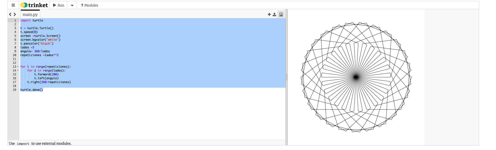

### P2TTP5 - Rotación de Poligonos

## Codigo

import turtle

t = turtle.Turtle()
t.speed(0)
screen =turtle.Screen()
screen.bgcolor("white")
t.pencolor("black")
lados =5
angulo= 360/lados
repeticiones =lados\*\*2

for i in range(repeticiones):
for z in range(lados):
t.forward(100)
t.left(angulo)
t.right(360/repeticiones)

turtle.done()

## Captura

## 

## Integrantes

Saavedra Herrera Efrain
Vargas Morin Jesus
Celaya Cordoba Joshua Mitch
Hector Miguel Arellano Perez
Diana Yoselyn Carrera Rosales
Rodolfo Huerta Ramirez
Angel Mauricio Lozada camacho
