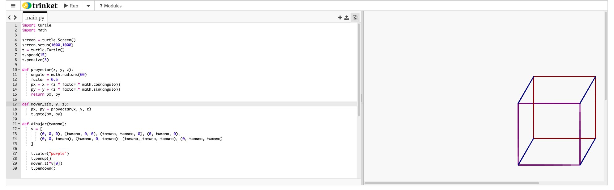

# Reporte: Representación Tridimensional con Python Turtle

---

## 1. ¿Qué es Turtle?

**Python Turtle** es un módulo estándar de Python inspirado en el lenguaje de programación Logo (desarrollado en los años 60 por Seymour Papert en el MIT). Proporciona una "tortuga" virtual que se mueve sobre un lienzo (canvas) siguiendo instrucciones del programador: avanzar, girar, levantar o bajar el lápiz, cambiar de color, etc.

El módulo viene incluido en la instalación estándar de Python, por lo que no requiere instalación adicional.

```python
import turtle
t = turtle.Turtle()
t.forward(100)
t.left(90)
```

---

## 2. ¿Para qué sirve Turtle?

El módulo Turtle sirve principalmente para:

- **Dibujo algorítmico**: Generación de fractales, espirales, figuras geométricas y patrones matemáticos.
- **Prototipado visual rápido**: Bocetos de figuras sin necesidad de herramientas externas.
- **Animaciones simples**: Movimiento de objetos gráficos en tiempo real.

---

## 3. Alcances y Limitaciones de Turtle

### Alcances

| Capacidad                | Descripción                                         |
| ------------------------ | --------------------------------------------------- |
| Dibujo 2D completo       | Líneas, curvas, rellenos, texto y figuras complejas |
| Sistema de coordenadas   | Coordenadas cartesianas centradas en pantalla       |
| Eventos e interactividad | Detección de clics del mouse y teclas del teclado   |
| Múltiples tortugas       | Se pueden crear varias tortugas simultáneas         |
| Control de velocidad     | Desde lento (1) hasta instantáneo (0)               |
| Colores y estilos        | RGB, colores por nombre, grosor de línea            |

### Limitaciones

- **No tiene soporte nativo 3D**: Turtle es estrictamente un entorno 2D. No existe una función `goto(x, y, z)` real.
- **Rendimiento bajo**: Para animaciones complejas o muchos elementos, Turtle es lento comparado con pygame, matplotlib o moderngl.
- **Sin manejo de texturas ni iluminación**: No puede simular materiales, sombras ni fuentes de luz.
- **Interfaz no escalable**: No es adecuado para proyectos grandes o producción.
- **Dependencia de Tkinter**: Requiere que Tkinter esté disponible, lo cual puede ser un problema en entornos sin interfaz gráfica (servidores).

---

### El Truco: Proyección de Coordenadas (Simulación 3D)

Para representar objetos tridimensionales en el lienzo 2D de Turtle, se utiliza una **proyección oblicua o isométrica**: se toman las coordenadas `(x, y, z)` del espacio 3D y se convierten matemáticamente a coordenadas 2D `(px, py)`.

#### Fórmula utilizada en el proyecto:

```python
def proyectar(x, y, z):
    angulo = math.radians(60)   # Ángulo de proyección del eje Z
    factor = 0.5                # Factor de escala para profundidad
    px = x + (z * factor * math.cos(angulo))
    py = y + (z * factor * math.sin(angulo))
    return px, py
```

**Explicación:**

- El eje `X` va hacia la derecha.
- El eje `Y` va hacia arriba.
- El eje `Z` (profundidad) se proyecta en diagonal a 60°, escalado al 50%.

Esto crea una **ilusión visual** de tridimensionalidad sin usar ninguna librería 3D real. Es la técnica clásica de proyección **axonométrica oblicua**, usada también en videojuegos 2D retro (como los primeros SimCity).

**Axonometria oblicua**
Es un método de proyección paralela donde los rayos no son perpendiculares al plano, creando una vista "oblicua" que muestra múltiples caras de un objeto desde un ángulo. Se usa comúnmente en dibujo técnico para vistas "caballeras" (cavalier) o "militar", con dos ejes horizontales y uno inclinado (típicamente 45° o 60°).

---

## 4. Propuesta de Solución

Para representar un cubo 3D usando Python Turtle se propone la siguiente estrategia:

1. **Definir los 8 vértices** del cubo en coordenadas 3D `(x, y, z)`.
2. **Aplicar una función de proyección** que convierta cada punto 3D a 2D usando trigonometría.
3. **Dibujar las aristas** del cubo en grupos:
   - **Cara inferior** (base en z=0): color púrpura.
   - **Cara superior** (tapa en z=tamano): color rojo oscuro.
   - **Aristas verticales** (entre las dos caras): color azul oscuro.
4. **Usar colores diferenciados** por cara para mejorar la percepción de profundidad.

Este enfoque es simple y funcional.

---

## 5. Código del Polígono (Cubo 3D)

```python
import turtle
import math

# Configuración de la pantalla
screen = turtle.Screen()
screen.setup(1000, 1000)

# Creación de la tortuga
t = turtle.Turtle()
t.speed(15)
t.pensize(3)

def proyectar(x, y, z):
    angulo = math.radians(60)
    factor = 0.5
    px = x + (z * factor * math.cos(angulo))
    py = y + (z * factor * math.sin(angulo))
    return px, py

def mover_t(x, y, z):
    """Mueve la tortuga a la posición proyectada en 2D."""
    px, py = proyectar(x, y, z)
    t.goto(px, py)

def dibujar(tamano):
    """Dibuja un cubo de lado 'tamano' usando proyección oblicua."""

    # Definición de los 8 vértices del cubo
    v = [
        (0, 0, 0),
        (tamano, 0, 0),
        (tamano, tamano, 0),
        (0, tamano, 0),
        (0, 0, tamano),
        (tamano, 0, tamano),
        (tamano, tamano, tamano),
        (0, tamano, tamano)
    ]

    # Cara 1
    t.color("purple")
    t.penup()
    mover_t(*v[0])
    t.pendown()
    for i in [1, 2, 3, 0]:
        mover_t(*v[i])

    # Cara 2
    t.color("darkred")
    t.penup()
    mover_t(*v[4])
    t.pendown()
    for i in [5, 6, 7, 4]:
        mover_t(*v[i])

    # Aristas
    t.color("darkblue")
    for i in range(4):
        t.penup()
        mover_t(*v[i])
        t.pendown()
        mover_t(*v[i + 4])

# Dibujar el cubo
dibujar(200)
t.hideturtle()
screen.mainloop()
```

### Explicación línea por línea

| Elemento                    | Función                                          |
| --------------------------- | ------------------------------------------------ |
| `screen.setup(1000, 1000)`  | Define el tamaño de la ventana gráfica           |
| `t.speed(15)`               | Velocidad máxima de dibujo (15 = ultra rápido)   |
| `t.pensize(3)`              | Grosor de las líneas dibujadas                   |
| `proyectar(x,y,z)`          | Transforma coordenadas 3D → 2D                   |
| `mover_t(x,y,z)`            | Mueve la tortuga usando proyección               |
| `t.penup()` / `t.pendown()` | Levanta / baja el lápiz para moverse sin dibujar |
| `t.goto(px, py)`            | Mueve la tortuga a posición absoluta             |
| `t.hideturtle()`            | Oculta el ícono de la tortuga al terminar        |

---

## 6. Capturas de la Representación Tridimensional


